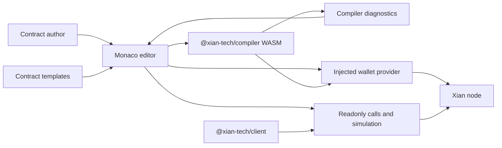

# xian-ide-web

`xian-ide-web` is the browser-based IDE for Xian smart contracts. It pairs
the Monaco editor with a Xian-specific theme, compiler-backed diagnostics,
contract templates, the JS client, and the injected wallet provider so
contract authors can read, edit, check, simulate, deploy, and execute
contract calls without leaving the browser.

The app is a Vite + React + TypeScript single-page app. It is
self-contained and consumes the public `@xian-tech/client` and
`@xian-tech/provider` packages from npm.

## Browser Flow



## Quick Start

`npm run build:compiler` requires `wasm-pack` plus a Rust toolchain with the
`wasm32-unknown-unknown` standard library installed.

```bash
npm install
npm run build:compiler
npm run dev          # local dev server
npm run build        # compiler + tsc + vite production build
npm run lint         # ESLint
npm run test         # Vitest integration tests
npm run preview      # serve the production build locally
```

Open the printed URL in a browser. Connect a Xian wallet through the
injected provider to deploy contracts and execute signed contract calls.

## Principles

- **Browser-native authoring.** The full author loop — edit, check,
  simulate, and submit contract calls — runs in the browser. There is no
  server-side component owned by this repo.
- **Deployment uses WASM artifacts.** The IDE compiles contract source in a
  browser-local `@xian-tech/compiler` WASM package, submits
  `deployment_artifacts` to `submission.submit_contract`, and lets the wallet
  client estimate chi unless an explicit chi value is supplied by the caller.
- **Compiler diagnostics are shared.** The Rust/WASM compiler package is the
  same compiler core used by the IDE, JS SDK, Python SDK, and CLI. The IDE
  renders the compiler's structured diagnostics directly in Monaco. The
  architecture is tracked in
  `../xian-contracting/docs/RUST_COMPILER_CORE.md`.
- **Wallet via injected provider.** Transaction signing uses
  `@xian-tech/provider`'s injected-wallet discovery and the user's
  installed Xian wallet. The IDE never holds private keys.
- **Templates are starting points.** Contract templates live in
  `src/lib/contract-templates.ts` and are exposed in the editor as
  starter content; they are not a contract registry.
- **Vendor SDKs from npm.** The IDE consumes published versions of
  `@xian-tech/client` and `@xian-tech/provider`, not sibling checkouts.

## Key Directories

- `src/` — application code:
  - `App.tsx`, `main.tsx` — root component and Vite entry.
  - `components/` — IDE UI components (editor wrapper, panels, terminals).
  - `hooks/` — custom React hooks (e.g. `useIDE`).
  - `lib/` — integration layer:
    - `xian-client.ts` — `@xian-tech/client` setup and helpers.
    - `compiler.ts`, `compiler-client.ts`, `deployment.ts` — WASM diagnostics,
      compilation, and artifact-backed contract deployment.
    - `wallet.ts` — injected-provider connection and transaction flow.
    - `contract-templates.ts` — starter contract templates.
  - `styles/`, `assets/` — Monaco theme, CSS, and static assets.
- `public/` — static assets served as-is.
- `index.html` — Vite HTML entrypoint.
- `vite.config.ts`, `tsconfig*.json`, `eslint.config.js` — build, type,
  and lint configuration.

## Validation

```bash
npm install
npm run build:compiler
npm run test
npm run lint         # ESLint
npm run build        # tsc -b && vite build (also runs the typecheck)
```

The IDE has no server side and no diagnostics service to configure. Functional
validation is the WASM compiler build, Vitest coverage for
diagnostics/compile/deploy payloads, the Vite production build, and interactive
testing in a browser with a Xian wallet installed.

## Related Repos

- [`../xian-js/README.md`](../xian-js/README.md) — JS / TS SDK and provider contract
- [`../xian-wallet-browser/README.md`](../xian-wallet-browser/README.md) — browser wallet that this IDE talks to via the injected provider
